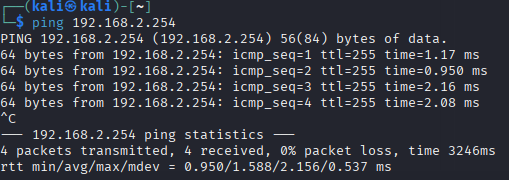
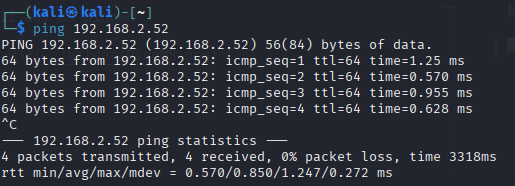

# Host Discovery

---
**Name:** Lukas Haselberger <br>
**Klasse:** 4AHITS <br>
**Datum:** 29.09.2025 <br>
**Fach:** ITSE - Labor <br>

# Ping

**Aufgabenstellung:**

Als host discovery (host scanning) versteht man den Vorgang um unbekannte Geräte in einem Netzwerk zu finden, bzw. festzustellen ob bekannte Geräte im Netzwerk erreichbar sind.

Das einfachste Werkzeug dafür ist **ping** .

* Verwende Kali und Metasploitable im Bridged Mode (Bridge ins Labor-Netzwerk)
* Experimentiere mit **ping**  im Labor-Netzwerk (Metasploitable, Default Gateway, …)
* Recherchiere zu den Optionen von **ping** , erstelle ein kleines Cheat Sheet
* Welchen Netzwerkdienst verwendet der **ping** Dienst? Recherchiere wie Firewalls häufig mit **ping**  umgehen.


## VMs in Bridged setzen

Zuerst gibt man sich lokale Adminrechte

Anachließend geht man links oben auf

```
Player
    | Manage
            |VM-Settings
                        |Network Adapters
                                        |Bridged
```

Außerdem muss man bei **Configure Adapters** da Labornetz auswählen

## pingen

### ORF von Kali pingen


### Default-Gateway von Kali pingen



### Kali auf MS pingen




## Optionen ping (Cheat sheet)

Die wichtigsten 5

```
-c                      --> Anzahl der Pings
```

```
-i <Sekunde>            --> sendet alle ... Sekunden einen ping
```

```
-s <Größe>              --> Größe der Pakete
```

```
-W <Sekunden>           --> Timout in Sekunden
```

```
-t                      --> Pingt unendlich lange
```


## ICMP

ping verwendet Echo-Request und Echo Reply. Dieses arbeiten auf der IP-Ebene und dient zur Fehlererkennung


# ping script

**Aufgabenstellung:**

Schreibe ein shell Skript das automatisiert (Schleife) alle Hosts im subnet anpingt. Die Ausgabe soll so sein, dass man daraus die aktiven Hosts erkennen kann (für nicht aktive Hosts soll keine Ausgabe sein).


**Script:**

```
#!/usr/bin/env bash
# scan_parallel.sh - schneller Scanner, killt bei STRG+C alle laufenden pings
BASE="${1:-192.168.1}"
CONCURRENCY="${2:-100}"   # Anzahl paralleler Pings (anpassen)
 
trap 'echo; echo "Abbruch: beende alle laufenden Pings..."; kill -- -$$ 2>/dev/null; exit 1' INT
 
for i in $(seq 1 254); do
  {
    ip="$BASE.$i"
    if ping -c1 -W1 -n "$ip" >/dev/null 2>&1; then
      echo "$ip"
    fi
  } &
 
  # concurrency limit
  while [ "$(jobs -rp | wc -l)" -ge "$CONCURRENCY" ]; do
    wait -n 2>/dev/null || break
  done
done
 
# warte auf restliche Kinder (oder Abbruch)
wait
```
