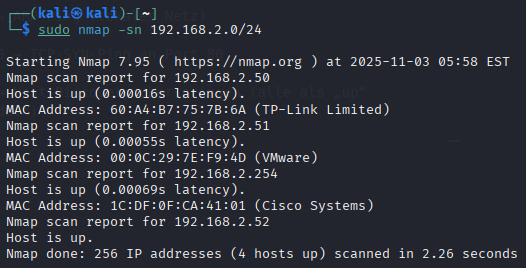
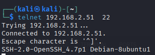
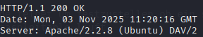
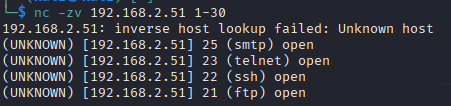

# Host discovery und Port probing und scanning

---
**Name:** Lukas Haselberger <br>
**Klasse:** 4AHITS <br>
**Datum:** 29.09.2025 <br>
**Fach:** ITSE - Labor <br>


## Host discovery

### Aufgabenstellung

nmap ist ein Tool zum network scanning. In einer ersten Phase (host discovery, ping scan oder ping sweep) ermittelt nmap alle aktiven Hosts.

**Aufgaben:**

Recherchiere zur grundlegenden Anwendung von nmap für einen sogenannten ping scan (host discovery).
Ermittle alle aktiven Hosts im Subnetz des Labor-Netzwerks mit nmap.


**Hinweise:**

nmap benötigt als Argument den IP Adressbereich des Subnet in Präfix Notation (z.B.: 192.168.178.0/24)
Mit der Option -sn führt nmap nur den ping scan durch (ansonsten wird automtisch auch die nächste, länger dauernde, Phase des scans ausgeführt)

**Recherchiere zur grundlegenden Anwendung von nmap für einen sogenannten ping scan (host discovery).**

* nmap findet heraus, welche Hosts in einem Netz sind, ohne die Ports zu scannen

- sn → Nur Host-Discovery (kein Portscan)

- PE → ICMP Echo (klassischer Ping)

- PR → ARP-Ping (lokales Netz)

- PS80 → TCP-SYN-Ping an Port 80

- Pn → Host-Discovery überspringen (alle als „up“ behandeln)


**Ermittle alle aktiven Hosts im Subnetz des Labor-Netzwerks mit nmap.**


```
$ sudo nmap -sn 192.168.2.0/24
```




## port probing

#### IP MS: 192.168.2.51


### Aufgabenstellung

Verwende telnet um festzustellen ob ein ssh Server auf Metasploitable läuft

```
$ telnet 192.168.2.51 22
``` 



**Aufgabe**

Finde Bezeichnung und die Versionsnummer des Web Servers auf Metasploitable heraus.

**Auf 3 Arten:**

#### Verwende telnet

```
$ telnet 192.168.2.51 80
``` 




#### Verwende nc (netcat)

```
$ nc 192.168.2.51  80 << EOF
GET / HTTP/1.1
Host: 192.168.2.51

EOF
```


Hinweis: der notwendige http request header kann am besten mit Hilfe eines Shell here-documents beschrieben werden.


#### Verwende curl

```
curl -I http://192.168.2.51
```


### Port Probing Cheat Sheet

---

### 1️⃣ Telnet
```telnet <IP> <PORT>```
- Prüft, ob ein TCP-Port erreichbar ist.
- Erweiterungen / Tipps:
  1. HTTP prüfen: GET / HTTP/1.1 + Host: <IP>
  2. SSH prüfen: Port 22 testen
  3. Manuell Banner anzeigen: Telnet zeigt offene Dienste direkt

---

### 2️⃣ Netcat (nc)
```nc <IP> <PORT>```
- Prüft die Erreichbarkeit eines Ports.
- Erweiterungen / Optionen:
  1. -z → Scan ohne Daten senden (nur prüfen, ob Port offen)
  2. -v → verbose Ausgabe für mehr Details
  3. -u → UDP statt TCP testen
```
Beispiel HTTP mit Here-Document:
nc <IP> 80 << EOF
GET / HTTP/1.1
Host: <IP>

EOF
```
---

### 3️⃣ Curl
```curl -I http://<IP>```
- Ruft nur HTTP-Header ab und zeigt Servername/Version.
- Erweiterungen / Optionen:
  1. -I → nur Header abrufen
  2. -v → verbose Ausgabe, zeigt Verbindungsdetails
  3. -L → Redirects automatisch folgen

Beispiel Port prüfen:
```curl http://<IP>:<PORT>```


## netcat port scaning

```
$ nc -zv 192.168.2.51 1-30
```



**Auf den Ports 1-30 befinden sich volgende Dienste:**

| Port | Dienst (Standard) |
| ---- | ----------------- |
| 22   | SSH               |
| 23   | Telnet            |
| 25   | SMTP              |
| 21   | FTP               |
| 20   | FTP (Data)        |
| 19   | Chargen (Test)    |


### nmap port scaning

```$ nmap -p- 192.168.2.51```

Host is up (0.0015s latency).
Not shown: 65505 closed tcp ports (reset)

PORT      STATE SERVICE
21/tcp    open  ftp<br>
22/tcp    open  ssh<br>
23/tcp    open  telnet<br>
25/tcp    open  smtp<br>
53/tcp    open  domain<br>
80/tcp    open  http<br>
111/tcp   open  rpcbind<br>
139/tcp   open  netbios-ssn<br>
445/tcp   open  microsoft-ds<br>
512/tcp   open  exec<br>
513/tcp   open  login<br>
514/tcp   open  shell<br>
1099/tcp  open  rmiregistry<br>
1524/tcp  open  ingreslock<br>
2049/tcp  open  nfs<br>
2121/tcp  open  ccproxy-ftp<br>
3306/tcp  open  mysql<br>
3632/tcp  open  distccd<br>
5432/tcp  open  postgresql<br>
5900/tcp  open  vnc<br>
6000/tcp  open  X11<br>
6667/tcp  open  irc<br>
6697/tcp  open  ircs-u<br>
8009/tcp  open  ajp13<br>
8180/tcp  open  unknown<br>
8787/tcp  open  msgsrvr<br>
37950/tcp open  unknown<br>
44551/tcp open  unknown<br>
57903/tcp open  unknown<br>
60857/tcp open  unknown<br>

MAC Address: 00:0C:29:7E:F9:4D (VMware)

Nmap done: 1 IP address (1 host up) scanned in 5.42 seconds


