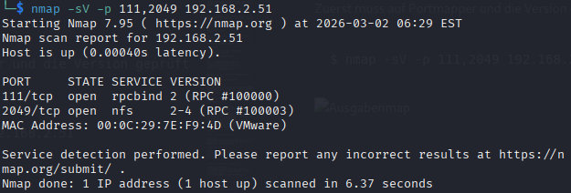

# portmapper/nfs vulnerability

---
**Name:** Lukas Haselberger <br>
**Klasse:** 4AHITS <br>
**Datum:** 02.03.2026 <br>
**Fach:** ITSE - Labor <br>

## Übung (ssh auf Metasploitable)

### Aufgabenstellung

Als Vorbereitung für die folgende Übung.

Konfiguriere passwortloses ssh Login auf Metasploitable mit Hilfe eines ssh Public/Private keys.

Betrachte besonders die notwendigen Änderungen in ~/.ssh/authorized_keys, diese Datei muss in der nachfolgenden Übung manipuliert werden.

Hinweis: der ssh-server auf Metasploitable unterstützt nur Schlüssel im RSA Format (nicht die neueren default Formate wie ed255…).
Der Kali ssh Client lehnt die Verbindung mit diesem alten Schlüssel standardmäßig ab, aber man kann es mit Optionen wieder erzwingen.
Bei ssh Verbindungsproblemen hilft häufig die Verwendung der Verbose Optionen des ssh clients (-v, -vv oder -vvv).


### Lösung:


```
 $ ssh-keygen -t rsa -b 2048 -m PEM -f ~/.ssh/metasploitable_rsa
```
Ist dazu da, um einen RSA-Key im PEM-Format zu erzeugen

Man muss anschließend noch ein Passwort aus mindestens 5 Zeichen erstellen

Nun muss man sich bei Metasploitable mit ssh anmelden. Dies geht mit folgendem Befehl:

```
ssh -i ~/.ssh/metasploitable_rsa \
-o HostKeyAlgorithms=+ssh-rsa \
-o PubkeyAcceptedAlgorithms=+ssh-rsa \
msfadmin@192.168.2.51
```
(Dieser Befehl muss verwendet werden, weil der normale ssh - Befehl nicht für Metasploitable 2 geeignet ist)

Fehler, der erscheint wenn man den normalen ssh - Befehl eingibt:

```
Unable to negotiate with 192.168.2.51 port 22: no matching host key type found. Their offer: ssh-rsa,ssh-dss
```

**Auf Metasploitable**

```
$ mkdir -p ~/.ssh
```

Um ein ssh - Verzeichnis zu erstellen (falls es noch keines gibt)

Mit dem Befehl **chmod 700** werden dem Verzeichnis nun Rechte gegeben

**Auf Kali**

Wir müssen jetzt den ssh - Key auf das metasploitable kopieren.

Dies geht mit folgendem Befehl:

```
cat ~/.ssh/metasploitable_rsa.pub | \
ssh -o HostKeyAlgorithms=+ssh-rsa \
-o PubkeyAcceptedAlgorithms=+ssh-rsa \
msfadmin@192.168.2.51 \
"cat >> ~/.ssh/authorized_keys"
```

Man muss sich jetzt per ssh auf Metasploitable verbinden und mit
```
chmod 600 ~/.ssh/authorized_keys
```
Rechte vergeben.

Ich habe vorher noch Passphrases vergeben (12345). Diese muss man nun vor dem ssh - Verbindungsaufbau eingeben und man verbindet sich dann mit Metasploitable.


## Übung (portmapper/nfs)

### Aufgabenstallung


Metasploitable 2 enthält eine Schwachstelle im Zusammenhang mit portmapper/nfs.

Informiere dich grob über nfs (network file system) und den Zusammenhang mit portmapper
Was kannst du über nmap und nmap scripts über die nfs Schwachstelle herausfinden?
Nutze die Schwachstelle aus indem du über das File-System einen ssh key in das Homeverzeichnis von root hineinschwindelst. Das Ziel ist, dass vom Angreifer-System aus ein passwortloses SSH login auf root@metasploitable möglich ist.

### Lösung

## NFS (Network File System)

**Kurz:**
NFS erlaubt es, Verzeichnisse über das Netzwerk zu exportieren, sodass andere Systeme sie mounten können – als wären sie lokal.

**Typischer Ablauf:**

* Server exportiert `/home`
* Client mountet das exportierte Verzeichnis
* Client kann Dateien lesen und schreiben (je nach Konfiguration)

---

## Rolle von Portmapper (rpcbind)

* NFS nutzt RPC‑Dienste.
* Portmapper (rpcbind) läuft meist auf Port 111.
* Er teilt Clients mit, auf welchen Ports die NFS-Dienste laufen.
* Ohne Portmapper funktioniert NFS nicht.

---

## Schwachstelle bei Metasploitable 2

* NFS ist aktiv
* `/home` wird exportiert
* **`no_root_squash` ist aktiviert**

**Bedeutung von no_root_squash:**

* Normalerweise wird Root vom Client zu „nobody“ gemappt (**root_squash**)
* Bei **no_root_squash** behält Root vom Angreifer Root-Rechte auf dem Server
* **Extrem unsicher**


Zuerst muss auf Portmapper und die Version geprüft werden.

```
$ nmap -sV -p 111,2049 192.168.2.51
```




